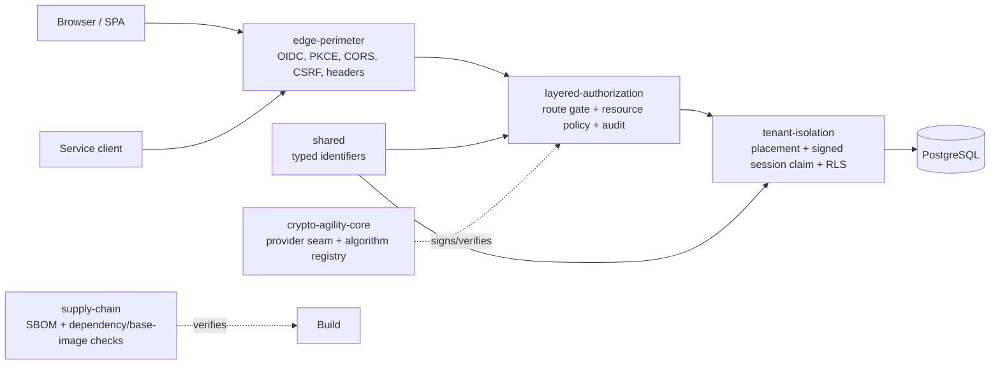

# Project Glyptodon

A production-oriented Java 21 security toolkit for multi-tenant SaaS systems.

Project Glyptodon is built by Joshua Matos and DoctrineOne Industries. It turns
hard platform-security decisions into usable Java modules, executable tests, and
ADR-backed operating guidance for teams building multi-tenant applications.

Use it as production-grade starting material: adopt modules directly, publish
them as internal Maven artifacts, or copy the patterns into an application with
the documented replacement points. The repository stays neutral and public-safe:
examples use fictional tenants, organizations, users, and documents.

## Quick Start

Requirements:

- JDK 21
- Docker, for Testcontainers-backed integration tests

Build and test everything:

```bash
./gradlew build
```

Publish the modules to your local Maven repository for application integration:

```bash
./gradlew publishToMavenLocal
```

Run focused modules:

```bash
./gradlew :tenant-isolation:test
./gradlew :layered-authorization:test
./gradlew :edge-perimeter:test
./gradlew :supply-chain:test
./gradlew :crypto-agility-core:test
./gradlew :crypto-agility-spring-boot-starter:test
./gradlew :crypto-agility-testkit:test
```

The test suite starts PostgreSQL containers where a pattern depends on real
database behavior.

## What You Can Use



| Module | Security pattern | What the tests prove |
|---|---|---|
| `shared` | Typed identity kernel | Tenant, organization, and resource IDs cannot be casually mixed as raw UUIDs. |
| `tenant-isolation` | Tenant placement, signed PostgreSQL session claims, and RLS | Tenant context reaches the database boundary and isolation holds under real PostgreSQL behavior. |
| `layered-authorization` | Coarse route gate plus fine-grained resource policy | Route, resource, deny-overrides, and audit behavior are enforced from the same decision point. |
| `edge-perimeter` | Browser/service credential plane separation | Browser sessions, service JWTs, CORS, CSRF, and headers stay in their intended boundary. |
| `supply-chain` | Build trust horizon | SBOM evidence and base-image pinning are executable checks, not review-only guidance. |
| `crypto-agility-core` | Provider seam and algorithm registry | Signing call sites stay stable while algorithms and providers can change behind the seam. |
| `crypto-agility-spring-boot-starter` | Spring Boot auto-configuration | A Spring app can inject `DocumentSigner` after wiring one provider/default key id. |
| `crypto-agility-testkit` | Provider and signer contracts | Provider implementers can reuse contract tests instead of copying internal test code. |

## Production Adoption

Glyptodon is designed for real production apps, but adoption must be explicit.
The modules provide tested boundaries and implementation patterns; your app owns
its environment-specific issuer, keys, database roles, tenant source of truth,
policy store, observability, incident process, and compliance validation.

Typical adoption paths:

- **Library adoption:** publish modules with `./gradlew publishToMavenLocal` or
  your internal Maven repository, then depend on selected modules.
- **Source adoption:** copy a module into a service and preserve the tests as
  contract tests while adapting package names and infrastructure.
- **Pattern adoption:** use the ADRs and tests as acceptance criteria for an
  existing platform implementation.

See [Production adoption guide](docs/PRODUCTION_ADOPTION.md) for integration
contracts, replacement points, and module-by-module hardening notes.

## Repository Layout

```text
modules/
|-- shared/                  # typed cross-module identifiers
|-- tenant-isolation/        # tenant placement, session binding, PostgreSQL RLS
|-- layered-authorization/   # coarse request gate + fine-grained policy
|-- edge-perimeter/          # BFF edge: dual credential planes, headers, CORS, CSRF
|-- supply-chain/            # build trust horizon: SBOM, dependency scan, base-image pin
|-- crypto-agility/          # compatibility artifact for crypto-agility-core
|-- crypto-agility-core/     # stable API, JCA providers, signer, registry
|-- crypto-agility-spring-boot-starter/ # optional Boot auto-configuration
|-- crypto-agility-testkit/  # reusable contract tests and fakes
|-- examples/                # standalone consumer examples
|-- docs/
|   |-- adr/                 # architecture decision records
|   `-- GLOSSARY.md          # shared vocabulary
|-- gradle/                  # version catalog and wrapper files
|-- CONVENTIONS.md           # repository rules
`-- README.md
```

## Architecture Posture

The repository demonstrates a layered posture where controls are structural,
explicit, and deny-by-default.

| Layer | Concern | Module |
|---|---|---|
| 1. Identity / AuthN | OIDC, PKCE, browser/service credential separation | `edge-perimeter` |
| 2. Authorization | Coarse route gate plus fine-grained resource policy | `layered-authorization` |
| 3. Secrets / config | No production secret in source or image | ADR-0001 and release checklist |
| 4. Transport / runtime | Perimeter routing, browser headers, actuator lockdown | `edge-perimeter` |
| 5. Data | Tenant placement, least-privilege roles, RLS | `tenant-isolation` |
| 6. Supply chain | SBOM, dependency, wrapper, and base-image verification | `supply-chain` |
| Cross-cutting | Signature-provider agility and migration strategy | `crypto-agility-core` |

## Public Release Posture

- This repository is intentionally neutral and uses fictional identifiers such as
  `acme` and `globex`.
- Do not add real customer, tenant, employer, internal-system, endpoint, or secret
  values to examples, tests, docs, issues, or pull requests.
- Cryptographic examples demonstrate API shape and migration boundaries. A
  listed algorithm or FIPS-approved algorithm identity is not a claim that every
  runtime provider, deployment, or environment is FIPS-validated.
- Production systems still need their own threat model, operational controls,
  compliance review, provider validation, and incident process.

## Documentation

- [Conventions](CONVENTIONS.md)
- [Contributing](CONTRIBUTING.md)
- [Security policy](SECURITY.md)
- [Support](SUPPORT.md)
- [Changelog](CHANGELOG.md)
- [Production adoption guide](docs/PRODUCTION_ADOPTION.md)
- [Public release checklist](docs/PUBLIC_RELEASE_CHECKLIST.md)
- [Glossary](docs/GLOSSARY.md)
- [ADR index](docs/adr/README.md)
- [ADR-0001: Five-layer security posture](docs/adr/0001-five-layer-security-posture.md)
- [ADR-0002: Tenant isolation with RLS session binding](docs/adr/0002-tenant-isolation-rls-session-binding.md)
- [ADR-0003: Layered authorization](docs/adr/0003-layered-authorization.md)
- [ADR-0004: Edge perimeter with dual credential planes](docs/adr/0004-edge-perimeter-dual-plane.md)
- [ADR-0005: Supply-chain trust horizon](docs/adr/0005-supply-chain-trust-horizon.md)
- [ADR-0006: Cryptographic agility](docs/adr/0006-crypto-agility-provider-seam.md)

## Development

Useful commands:

```bash
./gradlew test
./gradlew build
./gradlew :tenant-isolation:test --tests "*SchemaIsolationModeIntegrationTest"
./gradlew :layered-authorization:test --tests "*DocumentControllerSecurityTest"
./gradlew :edge-perimeter:test --tests "*RouteAuthorizationTest"
./gradlew :supply-chain:test --tests "*SbomIntegrityTest"
./gradlew :crypto-agility-core:test
```

Repository rules:

- One module demonstrates one pattern.
- A module must build from a clean clone with only JDK 21 and Docker.
- Shared types live in `shared` once, never duplicated.
- ADRs are append-only decision records.
- Examples use neutral fictional values such as `acme` and `globex`.

## License

Apache License 2.0. See [LICENSE](LICENSE) and [NOTICE](NOTICE).
