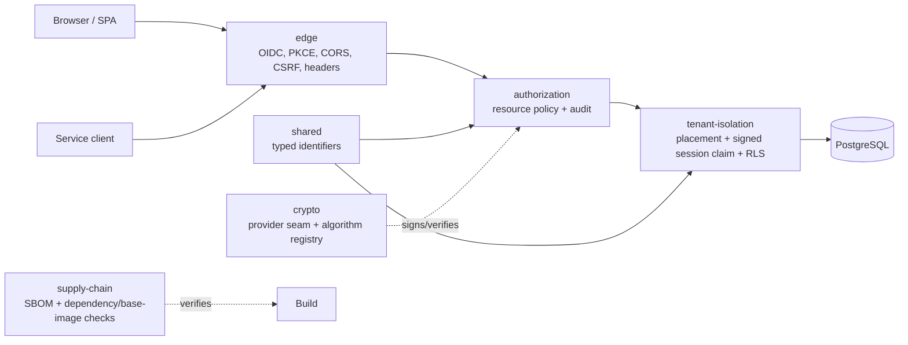

# Java Security Toolkit

[](https://github.com/joshuamatosdev/bulwark/actions/workflows/ci.yml)
[](https://joshuamatosdev.github.io/bulwark/)
[](LICENSE)
[](https://openjdk.org/projects/jdk/21/)

A Java 21 security toolkit. Built for multi-tenant SaaS systems.

Joshua Matos and DoctrineOne Industries build it. It turns hard security decisions
into modules. Each module ships with executable tests. Decision records explain
every choice.

Use it as starting material. Adopt modules directly. Publish them as internal
artifacts. Or copy the patterns out. The repository stays neutral and public-safe.
Examples use fictional tenants and users.

## Quick Start

Requirements:

- JDK 21
- Docker, for the integration tests

Build and test everything:

```bash
./gradlew build
```

Publish the modules to local Maven:

```bash
./gradlew publishToMavenLocal
```

Run focused modules:

```bash
./gradlew :tenant-isolation:test
./gradlew :tenant-isolation-spring-boot-starter:test
./gradlew :tenant-isolation-testkit:test
./gradlew :authorization:test
./gradlew :authorization-spring-boot-starter:test
./gradlew :authorization-testkit:test
./gradlew :authorization-showcase:test
./gradlew :edge:test
./gradlew :edge-spring-boot-starter:test
./gradlew :edge-testkit:test
./gradlew :supply-chain:test
./gradlew :supply-chain-testkit:test
./gradlew :crypto:test
./gradlew :crypto-spring-boot-starter:test
./gradlew :crypto-testkit:test
./gradlew :shared:test
./gradlew :shared-testkit:test
```

Some patterns need real database behavior. Those tests start PostgreSQL containers.

## What You Can Use



| Module | Security pattern | What the tests prove |
|---|---|---|
| `shared` | Typed identity kernel | IDs cannot mix as raw UUIDs. |
| `shared-testkit` | Identifier contracts | Adopters reuse the identifier contracts. |
| `tenant-isolation` | Signed session claims plus RLS | Isolation holds under real PostgreSQL. |
| `tenant-isolation-spring-boot-starter` | Boot auto-configuration | One dependency wires tenant isolation. |
| `tenant-isolation-testkit` | Tenant context contracts | Adopters prove binding and rejection. |
| `authorization` | Resource policy, deny-overrides, audit | One decision point enforces policy. |
| `authorization-spring-boot-starter` | Boot auto-configuration | Apps auto-wire the reference service. |
| `authorization-testkit` | Policy contracts | Adopters reuse allow/deny/audit checks. |
| `authorization-showcase` | Demo document API (not published) | Both gates run in one app. |
| `edge` | Credential plane separation | Each credential stays in its plane. |
| `edge-spring-boot-starter` | Boot auto-configuration | One starter wires the perimeter. |
| `edge-testkit` | Edge policy contracts | Adopters prove CORS and cookie policy. |
| `supply-chain` | Build trust horizon | Pin policies run as tests. |
| `supply-chain-testkit` | Supply-chain contracts | Adopters reuse the pin contracts. |
| `crypto` | Provider seam and registry | Call sites survive algorithm change. |
| `crypto-spring-boot-starter` | Boot auto-configuration | Apps inject `DocumentSigner` safely. |
| `crypto-testkit` | Provider and signer contracts | Provider authors reuse the contracts. |

## Production Adoption

The modules fit real production apps. Adoption must still be explicit. The
modules give tested boundaries and patterns. Your app owns its environment. That
means issuer, keys, and database roles. Also policy store, observability, and
compliance.

Typical adoption paths:

- **Library adoption:** publish with `./gradlew publishToMavenLocal`. Then depend
  on selected modules.
- **Source adoption:** copy a module in. Keep its tests as contracts.
- **Pattern adoption:** use ADRs as acceptance criteria.

See the [production adoption guide](docs/PRODUCTION_ADOPTION.md). It lists
replacement points and hardening notes.

## Repository Layout

```text
bulwark/
|-- shared/                  # typed cross-module identifiers
|-- shared-testkit/          # reusable typed identifier contracts
|-- tenant-isolation/        # tenant placement, session binding, PostgreSQL RLS
|-- tenant-isolation-spring-boot-starter/ # optional Boot auto-configuration
|-- tenant-isolation-testkit/ # reusable tenant context contracts
|-- authorization/           # framework-free authorization decision core
|-- authorization-spring-boot-starter/ # optional Boot auto-configuration
|-- authorization-testkit/   # reusable authorization contracts
|-- authorization-showcase/  # demonstration web app: route gate + document API (not published)
|-- edge/                    # BFF edge: dual credential planes, headers, CORS, CSRF
|-- edge-spring-boot-starter/ # optional Boot auto-configuration
|-- edge-testkit/            # reusable edge policy contracts
|-- supply-chain/            # build trust horizon: SBOM, dependency scan, base-image pin
|-- supply-chain-testkit/    # reusable supply-chain contracts
|-- crypto/                  # stable API, JCA providers, signer, registry
|-- crypto-spring-boot-starter/ # optional Boot auto-configuration
|-- crypto-testkit/          # reusable contract tests and fakes
|-- examples/                # standalone consumer examples
|-- docs/
|   |-- adr/                 # architecture decision records
|   `-- GLOSSARY.md          # shared vocabulary
|-- gradle/                  # version catalog and wrapper files
|-- CONVENTIONS.md           # repository rules
`-- README.md
```

## Architecture Posture

The controls are structural and explicit. Everything denies by default.

| Layer | Concern | Module |
|---|---|---|
| 1. Identity / AuthN | OIDC, PKCE, credential separation | `edge` |
| 2. Authorization | Route gate plus resource policy | `authorization` (gate shown in `authorization-showcase`) |
| 3. Secrets / config | No secret in source | ADR-0001 and release checklist |
| 4. Transport / runtime | Routing, headers, actuator lockdown | `edge` |
| 5. Data | Tenant placement, least privilege, RLS | `tenant-isolation` |
| 6. Supply chain | SBOM and pin verification | `supply-chain` |
| Cross-cutting | Signature-provider agility | `crypto` |

The posture is executable, not decorative. See
[`examples/five-layer-spring-boot`](examples/five-layer-spring-boot/). A BFF
fronts a resource service there. Tests drive one request through. Route gate,
policy decision, then RLS. Each layer refuses on its own.

## Public Release Posture

- The repository stays neutral. Identifiers like `acme` are fictional.
- Never add real customer or secret values. Not in examples, tests, or issues.
- Crypto examples show API shape only. Local signing keys are demo-only. A listed
  algorithm is not a FIPS claim. Validation depends on your runtime.
- Production systems still need more. Threat model, controls, compliance,
  incident process.

## Documentation

- [Conventions](CONVENTIONS.md)
- [Contributing](CONTRIBUTING.md)
- [Security policy](SECURITY.md)
- [Support](SUPPORT.md)
- [Changelog](CHANGELOG.md)
- [Production adoption guide](docs/PRODUCTION_ADOPTION.md)
- [Glossary](docs/GLOSSARY.md)
- [Architecture decisions](docs/adr/README.md)

## Development

Useful commands:

```bash
./gradlew test
./gradlew build
./gradlew :tenant-isolation:test --tests "*SchemaIsolationModeIntegrationTest"
./gradlew :authorization-showcase:test --tests "*DocumentControllerSecurityTest"
./gradlew :edge:test --tests "*RouteAuthorizationTest"
./gradlew :supply-chain:test --tests "*SbomIntegrityTest"
./gradlew :crypto:test
```

Repository rules:

- One module demonstrates one pattern.
- A clean clone must build. Only JDK 21 and Docker.
- Shared types live in `shared` once.
- ADRs are append-only decision records.
- Examples use fictional values like `acme`.

## License

Apache License 2.0. See [LICENSE](LICENSE) and [NOTICE](NOTICE).
