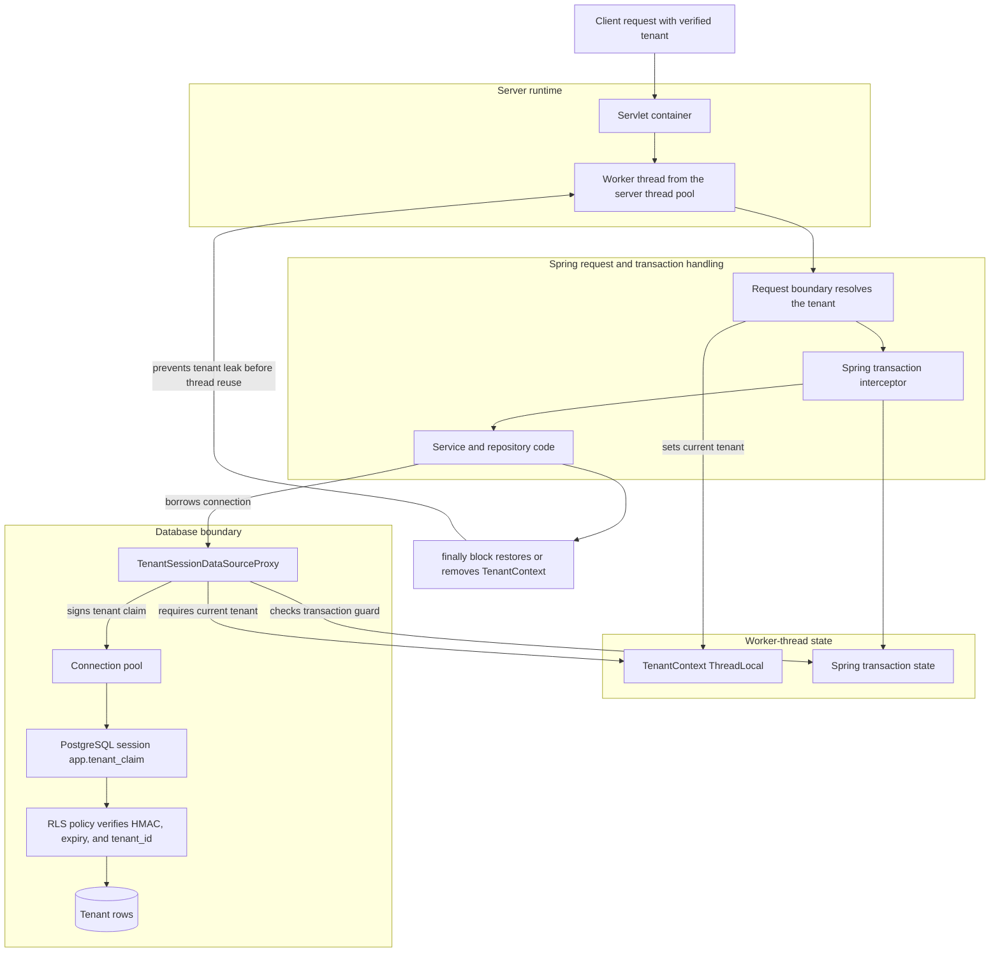

# Threads and Tenant Context Protection

This document explains how Java threads interact with tenant isolation in this
module, and why the code protects `TenantContext` as strictly as it does.

## What a Thread Is

A Java thread is one path of execution inside the JVM. Each thread has its own
call stack and local variables. Two requests can run at the same time because
they are handled by different threads.

Web servers usually do not create a brand-new thread for every request. They use
a thread pool. A worker thread can handle one request, return to the pool, and
later handle a different request.

That reuse matters for security. Anything stored on the thread can accidentally
survive longer than the request if it is not removed.

## What ThreadLocal Does

`ThreadLocal<T>` stores one value per thread:

```java
private static final ThreadLocal<TenantId> CURRENT = new ThreadLocal<>();
```

If thread A stores `ACME`, thread B does not see it. If thread B stores
`GLOBEX`, thread A does not see it.

That is useful for request facts such as the current tenant. It means code deep
in the call stack can ask, "which tenant is active for this request?" without
passing the tenant through every method signature.

It also creates two important risks:

1. A thread can be reused for a later request.
2. A new thread does not automatically get the parent thread's tenant.

The first risk can leak a tenant into later work. The second risk can make async
work run with no tenant at all.

## How This Module Uses It

`TenantContext` stores the active `TenantId` for the current thread. The
datasource proxy reads that value every time application code borrows a database
connection:

```text
request thread
  -> TenantContext has ACME
  -> repository asks for a connection
  -> TenantSessionDataSourceProxy reads ACME
  -> proxy signs app.tenant_claim for ACME
  -> PostgreSQL RLS verifies the claim
```

The tenant is not trusted merely because Java set a variable. Java only creates
the signed claim. PostgreSQL verifies the claim again before RLS uses it.

## Request Flow Diagram

The diagram below shows where the tenant value lives as a request moves through
the server, Spring, application code, and PostgreSQL.



Spring owns the request dispatch and transaction state. `TenantContext` owns the
tenant value for the current worker thread. The datasource proxy joins those
facts at the database boundary: it refuses to borrow a tenant-scoped connection
without a tenant, refuses unsafe tenant changes during a tenant transaction, and
binds the signed claim before SQL reaches PostgreSQL.

## Failure Modes

### Missing Tenant

If code borrows a tenant-scoped connection without a tenant, it would be unclear
which rows the request should be allowed to see.

This module fails closed. `TenantContext.requireCurrent()` throws when no tenant
is bound, and `TenantSessionDataSourceProxy` closes the raw connection if a
borrow happens without a tenant.

### Leaked Tenant

A thread pool worker can handle request A and then request B. If request A leaves
`ACME` in the thread local, request B could accidentally run as `ACME`.

This module avoids that by using scoped entry points:

```java
TenantContext.runAs(TenantIds.ACME, () -> {
    // tenant-scoped work
});
```

`runAs` and `supplyAs` save the prior tenant, set the new tenant, run the work,
and restore the prior value in a `finally` block. If no tenant was previously
bound, the restore path removes the thread-local value completely.

That `finally` block is the reason normal code should use scoped entry points
instead of direct setters.

### System Operations Through the Normal Path

System operations use a separate read-only database role that can read across
tenants. That is intentionally not a normal request tenant.

Ordinary entry points reject `TenantIds.SYSTEM_OPS`:

```java
TenantContext.runAs(TenantIds.SYSTEM_OPS, work); // rejected
```

System operations must use the explicit system-ops entry points:

```java
TenantContext.runAsSystemOps(work);
TenantContext.supplyAsSystemOps(work);
```

This makes cross-tenant reads visible at the call site.

### Tenant Switch After a Transaction Starts

A transaction usually borrows its database connection at the beginning. The
datasource binds the tenant claim to that borrowed database session. If code
tries to change tenants after the transaction has started, the Java thread-local
value and the database session can disagree.

This module rejects that pattern. The tenant must be bound before a tenant
transaction starts.

Correct shape:

```java
TenantContext.runAs(TenantIds.ACME, () -> {
    transactionalService.doTenantWork();
});
```

Risky shape:

```java
@Transactional
void doTenantWork() {
    TenantContext.runAs(TenantIds.ACME, () -> repository.findAll());
}
```

The risky shape binds the tenant inside a transaction that may already have a
connection. The guard rejects a first bind or a tenant switch during an active
tenant transaction. Re-entering the same tenant is allowed.

In a single-datasource application, the default check treats any active Spring
transaction as the tenant transaction. In a multi-datasource application, startup
code can install a narrower check with
`TenantContext.useTenantTransactionActiveCheck(...)` so an unrelated transaction
does not block tenant binding.

### Async Work

A normal `ThreadLocal` is not inherited by a new thread. That is intentional
here. Implicit inheritance can make tenant context outlive the request that
created it.

Async work must bind the tenant explicitly:

```java
TenantId tenant = TenantContext.requireCurrent();

executor.submit(() ->
    TenantContext.runAs(tenant, () -> {
        // async tenant-scoped work
    }));
```

If async work forgets to bind the tenant, the datasource proxy fails closed when
it tries to borrow a connection.

## Why the Datasource Also Protects Itself

`TenantContext` is an early guard. It gives clear errors before unsafe work runs.
The database boundary still protects itself.

`TenantSessionDataSourceProxy` checks the current tenant on every connection
borrow. It signs the tenant claim and writes it into the PostgreSQL session. If
binding fails, it aborts the raw connection instead of returning it to the pool
in an unknown state.

When a guarded connection closes, the proxy clears `app.tenant_claim` before the
raw connection returns to the pool. That prevents the next borrower from
inheriting the prior borrower's database session tenant.

The connection proxy also blocks unsafe JDBC wrapper escape paths. Calls such as
`unwrap(VendorConnection.class)` do not expose the raw delegate connection,
because that would bypass the close/reset handler.

## Summary

The thread-local tenant is convenient, but convenience is not the security
boundary. This module treats it as request-local input that must be scoped,
restored, checked before transactions, and verified again at the database.

The protections work together:

- `ThreadLocal` keeps tenant context per thread.
- Scoped `runAs` and `supplyAs` restore or remove the value after work completes.
- Ordinary tenant entry points reject the system-ops tenant.
- Tenant binding must happen before a tenant transaction starts.
- Async work must bind tenant context explicitly.
- The datasource proxy fails closed when no tenant is bound.
- PostgreSQL verifies the signed claim before RLS trusts it.
- The connection proxy clears session state before returning to the pool.
