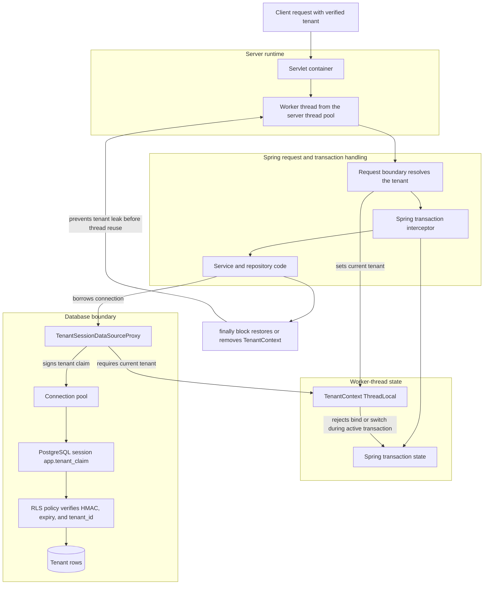

# Threads and Tenant Context Protection

This document covers Java threads. It explains this module's tenant isolation.
The code guards `TenantContext` strictly. This document explains why.

## What a Thread Is

A Java thread runs one path. It runs inside the JVM. Each thread has its own
stack. Each has its own local variables. Two requests can run together.
Different threads handle them.

A server rarely makes new threads. Not one per request. They use a thread pool.
A worker thread handles one request. Then it returns to the pool. Later it
handles another request.

That reuse matters for security. Data can sit on a thread. You must remove it.
Otherwise it can outlive the request.

## What ThreadLocal Does

`ThreadLocal<T>` stores one value per thread:

```java
private final ThreadLocal<TenantBinding> current = new ThreadLocal<>();
```

Thread A stores `ACME`. Thread B cannot see it. Thread B stores `GLOBEX`.
Thread A cannot see it.

This helps store request facts. The current tenant is one. Deep code can ask one
question. Which tenant is active now? No method needs a tenant parameter.

It also creates two important risks:

1. A later request may reuse it.
2. A new thread starts clean. It skips the parent's tenant.

The first risk leaks a tenant. It leaks into later work. The second risk drops
the tenant. Async work runs with none.

## How This Module Uses It

`TenantContext` stores the active `TenantId`. It holds it per thread. The
datasource proxy reads that value. It reads on every connection borrow:

```text
request thread
  -> TenantContext has ACME
  -> repository asks for a connection
  -> TenantSessionDataSourceProxy reads ACME
  -> proxy signs app.tenant_claim for ACME
  -> PostgreSQL RLS verifies the claim
```

Java setting a variable proves nothing. Java only creates the signed claim.
PostgreSQL verifies the claim again. It checks before RLS uses it.

## Request Flow Diagram

The diagram below tracks the tenant. It follows one request through. The path
covers server and Spring. Then application code and PostgreSQL.



Spring owns request dispatch. Spring owns transaction state. `TenantContext`
owns the tenant value. It owns it per worker thread. It runs the
tenant-before-transaction guard. Suppose a tenant transaction is active. Then a
first bind is rejected. An unsafe switch is rejected too. This covers tenant and
organization switches. Rejection happens at bind time. The datasource proxy
joins these facts. It acts at the database boundary. It refuses an unbound
borrow. It binds the signed claim first. This happens before SQL reaches
PostgreSQL.

## Failure Modes

### Missing Tenant

Code may borrow a tenant-scoped connection. But it binds no tenant. Then the
allowed rows are unclear.

This module fails closed. The injected `tenantContext.requireCurrent()` throws with no
tenant. `TenantSessionDataSourceProxy` rejects the borrow. It rejects before
taking a connection. It never touches a raw connection.

### Leaked Tenant

A pool worker handles request A. Then it handles request B. Request A may leave
`ACME` behind. It sits in the thread local. Request B could run as `ACME`.

This module uses scoped entry points. They prevent that leak:

```text
tenantContext.runAs(TenantIds.ACME, () -> {
    // tenant-scoped work
});
```

`runAs` and `supplyAs` work in steps. They save the prior tenant. They set the
new tenant. They run the work. They restore the prior value. A `finally` block
does the restore. Maybe no tenant was bound before. Then it clears the
thread-local value.

That `finally` block matters. So prefer scoped entry points. Avoid direct
setters.

### System Operations Through the Normal Path

System operations use a separate role. The role is read-only. It can read across
tenants. This is not a normal tenant. That is deliberate.

Ordinary entry points reject `TenantIds.SYSTEM_OPS`:

```text
tenantContext.runAs(TenantIds.SYSTEM_OPS, work); // rejected
```

Use the explicit system-ops entry points:

```text
tenantContext.runAsSystemOps(work);
tenantContext.supplyAsSystemOps(work);
```

This makes cross-tenant reads visible. They show at the call site.

### Tenant Switch After a Transaction Starts

A transaction borrows a connection. This usually happens at the start. The
datasource binds the tenant claim. It binds to that database session. Code might
change tenants mid-transaction. Then two values can disagree. The thread-local
and the session.

This module rejects that pattern. The tenant binds before the transaction.

Correct shape:

```text
tenantContext.runAs(TenantIds.ACME, () -> {
    transactionalService.doTenantWork();
});
```

Risky shape:

```java
@Transactional
void doTenantWork() {
    tenantContext.runAs(TenantIds.ACME, () -> repository.findAll());
}
```

The risky shape binds late. That transaction may hold a connection. The guard
rejects a first bind. It rejects a tenant switch too. This applies during active
tenant transactions. Re-entering the same tenant is allowed.

Consider a single-datasource application. The default check is broad. It counts
any active Spring transaction. Each becomes the tenant transaction. Now consider
multiple datasources. Supply an application-scoped `TenantContext` bean whose
`BooleanSupplier` reports only the tenant datasource's transaction activity. The starter backs
off when that bean is present:

```java
@Bean
TenantContext tenantContext(TenantTransactionMonitor transactions) {
    return new TenantContext(transactions::isTenantTransactionActive);
}
```

### Async Work

A normal `ThreadLocal` is not inherited. A new thread skips it. That is
intentional here. Implicit inheritance would be risky. Tenant context could
outlive its request.

Async work must bind the tenant. Do it explicitly:

```text
TenantId tenant = tenantContext.requireCurrent();

executor.submit(() ->
    tenantContext.runAs(tenant, () -> {
        // async tenant-scoped work
    }));
```

Async work might forget to bind. Then the datasource proxy fails closed. This
happens on the connection borrow.

## Why the Datasource Also Protects Itself

`TenantContext` is an early guard. It errors before unsafe work runs. The
database boundary still protects itself.

`TenantSessionDataSourceProxy` checks the current tenant. It checks on every
borrow. It signs the tenant claim. It writes it to PostgreSQL. Binding might
fail. Then it aborts the raw connection. It never pools an unknown state.

A guarded connection may close. Then the proxy clears `app.tenant_claim`. It
clears before the connection pools. The next borrower inherits nothing. No prior
session tenant remains.

The proxy also blocks escape paths. These are unsafe JDBC wrapper calls. Take
`unwrap(VendorConnection.class)`. It hides the raw delegate connection. That
would bypass the close/reset handler.

## Summary

The thread-local tenant is convenient. Convenience is not the security boundary.
This module treats it as input. That input is request-local. The input must be
scoped. It must be restored. It must be checked before transactions. The
database verifies it again.

The protections work together:

- `ThreadLocal` keeps tenant context per thread.
- `runAs` and `supplyAs` are scoped. They restore or remove the value. This
  happens after the work.
- Ordinary entry points reject system-ops.
- Bind the tenant before its transaction.
- Async work binds the tenant explicitly.
- The datasource proxy fails closed. It fails when unbound.
- PostgreSQL verifies the signed claim. It verifies before RLS trusts it.
- The connection proxy clears session state. It clears before pooling the
  connection.
